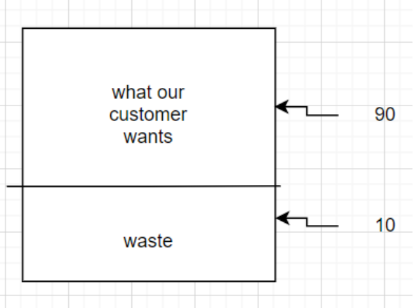
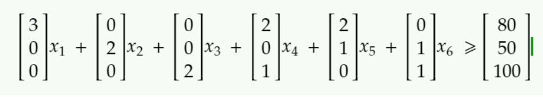
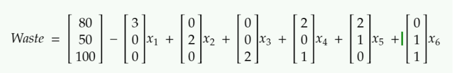
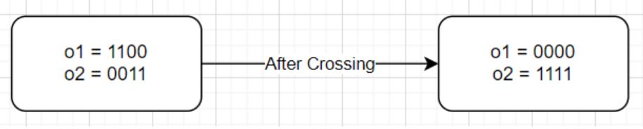
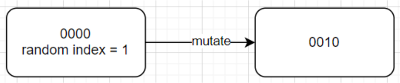
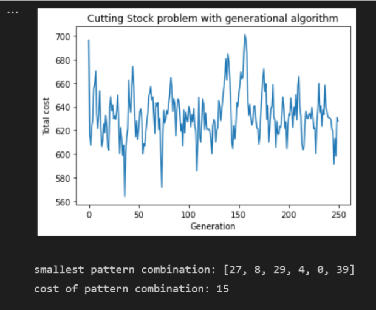

# Cutting Stock

### Description
An genetic algorithm designed to find an optimal solution to a given cutting stock problem

**The Cutting Stock problem**
The cutting stock problem is an optimization problem where we have to fill out an order of paper while producing the least amount of scrap possible.

**The Cutting Stock problem illustrated**

Let's say that I have an industrial paper-making machine that can only create rolls of paper with a width of 100 units. This is a problem for my customer, because he doesn't want paper with a width of 100, he wants a width of 90. That means to complete his order I would have to waste about 10 units of paper.

**Our cutting stock problem**

**In written language**

Let&#39;s assume now that we can only produce paper with a width of 15 units. Now let&#39;s assume that we have an order where our customer wants 80 rolls of 4-width paper, 50 rolls of 6-width paper, and 100 boards of 7-width paper. How can we cut our rolls of 15-width paper so that we produce the least amount of waste possible?

| Width | Number of rolls |
| --- | --- |
| 4 | 80 |
| 6 | 50 |
| 7 | 100 |

**In mathematics**

First, we can think of the ways that we can cut 15 into 4, 6, and 7 as patterns. These patterns can then be represented as matrices for the problem. For this problem there are only 6 ways we can cut our big roll of paper, any other way converges into one of the 6.

| Width | Patten 1 | Pattern 2 | Pattern 3 | Pattern 4 | Pattern 5 | Pattern 6 |
| --- | --- | --- | --- | --- | --- | --- |
| 4 | 3 | 0 | 0 | 2 | 2 | 0 |
| 6 | 0 | 2 | 0 | 0 | 1 | 1 |
| 7 | 0 | 0 | 2 | 1 | 0 | 1 |

Now we can rephrase the problem. What we want to know is how many times we need to cut each pattern so that we satisfy the customer with the least amount of waste. We can represent this as an equation.

**Putting it all together**

We need to find values for [x1, x2, x3, x4, x5, x6] such that the equation above is greater than or equal to the customer&#39;s order while at the same time minimizing the waste that is being used.

**Design**

**Organism**

Each organism in the generation is an object of the Organism class. The class has two properties, _pattern_Com_ and _cost_.

**pattern_Com** : an array of 6 binary strings which tell us how many of each pattern to use. For example, [001, 000, 000, 000, 000, 010] tells us to use pattern 1 one time and pattern 6 two times.

**Cost** : this is the total amount of waste that the pattern combination produces. If the combination is unable to meet the customer demands we give it a cost of 100,000 which is an arbitrary high value.

Cost function: to find the total fitness of the organism, we use this formula.

Where x1...x6 are the pattern combinations in the matrix pattern_Com

**Picking the best organisms:**

The best organisms are selected using elite selection. This means that the top half organisms are chosen and then those organisms are doubled in order to maintain a constant generation size.

**Crossover:**

After the best organism is selected they are randomly paired then crossed with another organism. Let&#39;s say there are two random organisms o1 and o2. Crossing works by splitting the binary string of both organisms into two halves part 1 and part 2. Then o1 and o2 swap their part 1 strings. We do this for every binary string inside of the pattern combination matrix.

**Mutation** :

Next we mutate the organism for the next iteration. To mutate an organism&#39;s binary string, we go through each binary string inside of the pattern combination matrix and pick a random number from 0 to 6, afterwards, we change the value of the character. So a value of 1 will become 0 and vice versa.

**Output**

This means we need to cut 27 rolls according to pattern 1, 8 rolls according to pattern 2, 29rolls according to pattern 3, 4 rolls to pattern 4, 0 rolls to pattern 5, and 39 rolls to pattern 6. To better visualize what we are doing, let&#39;s turn the pattern combination into a matrix representing the total number of rolls we would have.

This means that the total number of rolls we made is…

So our waste matrix (rolls we made - the actual order) is…

We will have a total waste of 15 rolls (9 + 5 + 1), and this is the minimum amount of waste that will be produced if we complete an order for 80 rolls of 4 width paper, 50 rolls of 6 width paper, and 100 rolls of 7 width paper.
